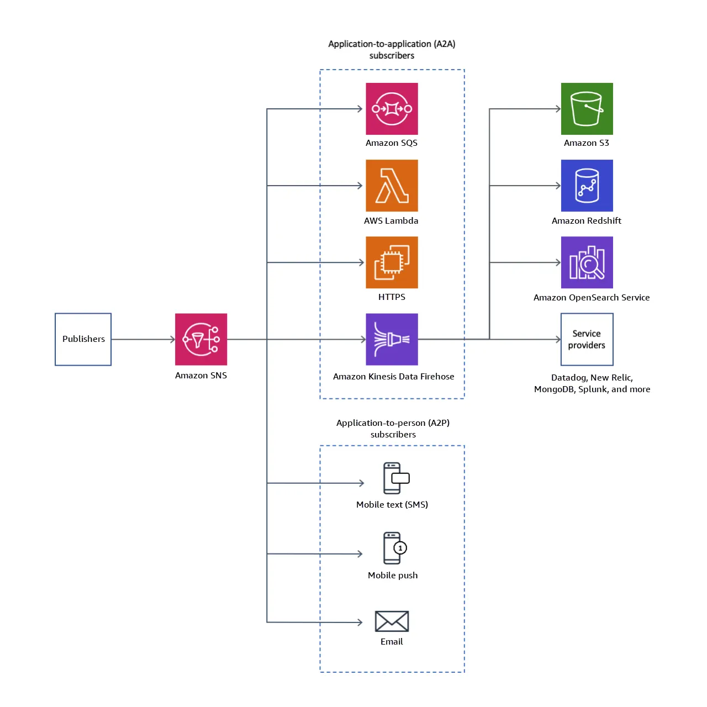
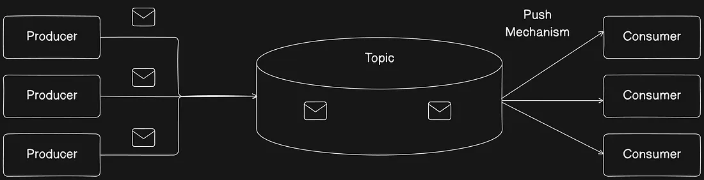
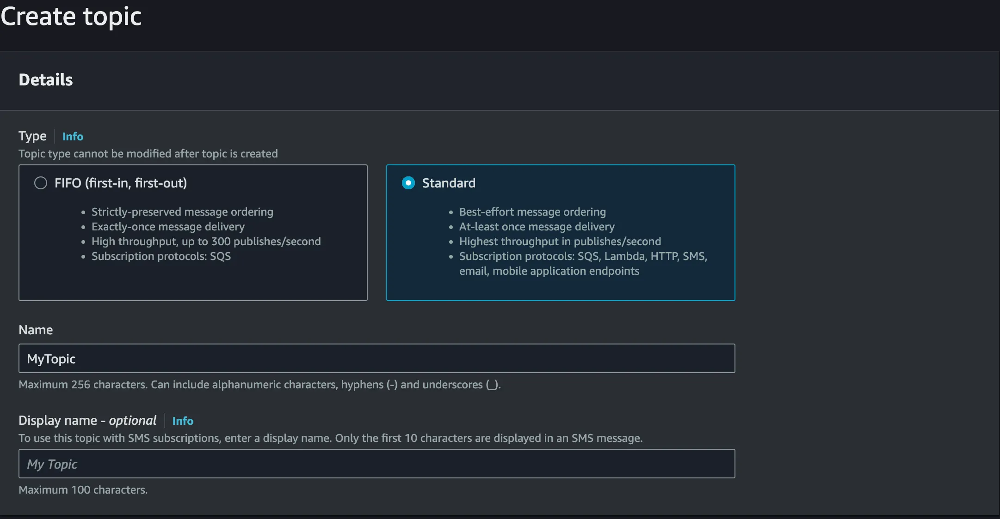

# AWS SNS and when to use

## Overview
Amazon Simple Notification service or SNS, is a message service for applications, can be managed to notify pusblishers (apps) and subscrivbers (apps).




## When to use
1. Fan-Out Pattern
Fanout Pattern refers to a system design approach for efficiently distributing data to multiple consumers in a scalable manner.



2. Real time notification
  * Alert Systems
  * Notification, (email, sms, push notification)
  * Webhooks to external software

3. Event Broadcaster
A single event must be delivered to different places

4. Micro Service decoupler
When services needs to react to events even don't knwoing each other

5. Mult-Region / Mult-AWS-Accounts
As sub-title says, propagate events to different regions or AWS accounts

**Note "SNS" do not guarantee that messages will be unique** 

## WHen NOT to use SNS
* Sequential proccess
* Only one or few consumers
* Complex retry order (for it, sns + sqs is a must on)
* Big messages, SNS can deliver max 256kb

## SNS in Deep


### Core components

- Publisher
- Message
- Topic
- Subscriber

#### Pusblisher

Publishers are the ones who generate data and send it through a Topic
It can be made with the AWS SNS SDK or AWS Services that have integrations with SNS, like an S3 bucket.

#### Message

Messages are the data payloads sent by publishers to a topic. Each message can be up to 256 KB in size and supports different formats (JSON, plain text, etc.).

Messages can include attributes that provide metadata about the content, enabling subscribers to filter messages based on their needs. For FIFO topics, messages must include a MessageGroupId to maintain order and a MessageDeduplicationId to prevent duplicates.

#### Topic
SNS topic is a logical access point that acts as a communication channel. A topic allow to group multiple endpoints (such as AWS Lambda, Amazon SQS, HTTP/S, or an email address).

To broadcast the messages of a message-producer system (for example, a notification system) working with multiple other services that require its messages (for example, email service, SMS service, and notification analytic service), you can create a topic for your producer system.

When creating a Topic we choose between a Standard topic and a FIFO Topic like bellow: 



#### Subscriber

Subscribers are the endpoints that receive messages from a topic. They subscribe to topics they are interested in and receive notifications when new messages are published.

SNS supports multiple types of subscribers including AWS Lambda functions, SQS queues, HTTP/HTTPS endpoints, email addresses, SMS, and mobile push notifications. Each subscriber can have its own filter policy to receive only the messages that match specific criteria, reducing unnecessary processing.


```jsx
// example of SNS sent using node
import { SNSClient, PublishCommand } from "@aws-sdk/client-sns";
const client = new SNSClient(config);

const input = {
  TopicArn: "STRING_VALUE",
  TargetArn: "STRING_VALUE", // optional
  PhoneNumber: "STRING_VALUE", // optional
  Message: "STRING_VALUE",
  MessageAttributes: {
    "Version": {
      DataType: "Number",
      StringValue: "1"
    },
  },
  MessageDeduplicationId: "STRING_VALUE", // required for FIFO topics
  MessageGroupId: "STRING_VALUE", // required for FIFO topics
  Subject: "STRING_VALUE" // optional
};
const command = new PublishCommand(input);
const response = await client.send(command);
```

### Sources
* https://docs.aws.amazon.com/pt_br/sns/latest/dg/welcome.html
* https://docs.aws.amazon.com/pt_br/sns/latest/dg/sns-create-topic.html
* https://medium.com/@joudwawad/aws-sns-deep-dive-6cc9cefbb9bb
* https://aws.plainenglish.io/how-to-configure-an-event-driven-architecture-to-send-data-to-sns-3197acc88293
* https://medium.com/@joudwawad/notification-system-architecture-with-aws-968103c2c730
* https://docs.aws.amazon.com/pt_br/sns/latest/dg/sns-event-sources.html