# 4.2 Deployment Diagram (EKS Variant)

The diagram below shows the AWS infrastructure distributed across **3 regions** (US-East, EU-West, AP-Southeast) to reach the **250k RPS** peak. Regions serve traffic locally with Route53 failover; writes are centralized in the primary region.

> **Note:** This is an alternative version using **EKS (Elastic Kubernetes Service)** instead of ECS Fargate. See [4.2-deployment-diagram.md](4.2-deployment-diagram.md) for the ECS Fargate version.

```mermaid
flowchart TB
    subgraph Internet["Internet"]
        Users["Global Users<br/>(300M potential)"]
        TVApp["TV Show App<br/>(Frontend)"]
    end

    subgraph Edge["AWS Edge Services"]
        Route53["Route53<br/>DNS + Geo Routing<br/>+ Health Checks"]
        WAF["AWS WAF<br/>DDoS Protection<br/>Rate Limiting"]
        CloudFront["CloudFront<br/>Static Assets CDN"]
    end

    subgraph Auth0Cloud["Auth0 (External)"]
        Auth0["Auth0<br/>Identity Provider<br/>OAuth2/OIDC"]
    end

    Users --> TVApp
    TVApp --> Route53
    Route53 --> WAF
    WAF --> CloudFront

    subgraph Region1["US-EAST-1 (Primary)"]
        subgraph VPC1["VPC 10.0.0.0/16"]
            subgraph PublicSubnet1["Public Subnets (AZ-a, AZ-b, AZ-c)"]
                APIGW1["API Gateway<br/>100k RPS limit<br/>JWT Validation"]
                ALB1["ALB<br/>(AWS LB Controller)<br/>Ingress Traffic"]
            end
            
            subgraph PrivateSubnet1["Private Subnets (AZ-a, AZ-b, AZ-c)"]
                subgraph EKS1["EKS Cluster"]
                    subgraph ControlPlane1["Control Plane (AWS Managed)"]
                        APIServer1["API Server"]
                        etcd1["etcd"]
                        Scheduler1["Scheduler"]
                    end
                    
                    subgraph NodeGroup1["Managed Node Group"]
                        Node1A["EC2 Node (m6i.2xlarge)<br/>AZ-a"]
                        Node1B["EC2 Node (m6i.2xlarge)<br/>AZ-b"]
                        Node1C["EC2 Node (m6i.2xlarge)<br/>AZ-c"]
                    end
                    
                    subgraph Workloads1["Kubernetes Workloads"]
                        AuthDeploy1["Deployment: Auth Service<br/>3-10 replicas"]
                        VoteDeploy1["Deployment: Vote Service<br/>10-100 replicas"]
                        ResultsDeploy1["Deployment: Results Service<br/>5-30 replicas"]
                    end
                    
                    subgraph K8sServices1["Kubernetes Services"]
                        AuthSvc1["Service: auth-svc<br/>ClusterIP"]
                        VoteSvc1["Service: vote-svc<br/>ClusterIP"]
                        ResultsSvc1["Service: results-svc<br/>ClusterIP"]
                    end
                    
                    Ingress1["Ingress Resource<br/>(ALB Ingress Controller)"]
                end
                
                SQS1["SQS Queue<br/>Vote Buffer<br/>+ DLQ"]
            end
            
            subgraph DataSubnet1["Data Subnets (AZ-a, AZ-b)"]
                RDS1[("RDS PostgreSQL<br/>Primary<br/>db.r6g.4xlarge<br/>Multi-AZ")]
                Redis1["ElastiCache Redis<br/>Cluster Mode<br/>Vote Aggregates"]
            end
        end
    end

    subgraph Region2["EU-WEST-1"]
        subgraph VPC2["VPC 10.1.0.0/16"]
            APIGW2["API Gateway"]
            ALB2["ALB"]
            subgraph EKS2["EKS Cluster"]
                NodeGroup2["Managed Node Group<br/>3 nodes"]
                Workloads2["Auth | Vote | Results<br/>Deployments"]
            end
            SQS2["SQS Queue"]
            RDS2[("RDS PostgreSQL<br/>Read Replica")]
            Redis2["ElastiCache Redis"]
        end
    end

    subgraph Region3["AP-SOUTHEAST-1"]
        subgraph VPC3["VPC 10.2.0.0/16"]
            APIGW3["API Gateway"]
            ALB3["ALB"]
            subgraph EKS3["EKS Cluster"]
                NodeGroup3["Managed Node Group<br/>3 nodes"]
                Workloads3["Auth | Vote | Results<br/>Deployments"]
            end
            SQS3["SQS Queue"]
            RDS3[("RDS PostgreSQL<br/>Read Replica")]
            Redis3["ElastiCache Redis"]
        end
    end

    subgraph SharedServices["Shared Services"]
        SecretsManager["Secrets Manager<br/>DB Credentials<br/>API Keys"]
        CloudWatch["CloudWatch<br/>Logs + Metrics"]
        ECR["ECR<br/>Container Registry"]
        S3Audit["S3<br/>Audit Logs"]
    end

    subgraph Observability["Observability Stack"]
        Prometheus["Prometheus<br/>(In-Cluster)"]
        Grafana["Grafana<br/>Dashboards"]
    end

    %% Edge to Regions
    WAF --> APIGW1
    WAF --> APIGW2
    WAF --> APIGW3

    %% Region 1 Flow
    APIGW1 --> ALB1 --> Ingress1
    Ingress1 --> AuthSvc1 --> AuthDeploy1
    Ingress1 --> VoteSvc1 --> VoteDeploy1
    Ingress1 --> ResultsSvc1 --> ResultsDeploy1
    
    VoteDeploy1 --> SQS1
    SQS1 --> VoteDeploy1
    VoteDeploy1 --> RDS1
    VoteDeploy1 --> Redis1
    ResultsDeploy1 --> Redis1
    ResultsDeploy1 --> RDS1
    AuthDeploy1 --> Auth0
    AuthDeploy1 --> Redis1

    %% Region 2 Flow
    APIGW2 --> ALB2 --> EKS2
    Workloads2 --> SQS2
    Workloads2 -->|Reads| RDS2
    Workloads2 --> Redis2
    Workloads2 -.->|Writes| RDS1

    %% Region 3 Flow
    APIGW3 --> ALB3 --> EKS3
    Workloads3 --> SQS3
    Workloads3 -->|Reads| RDS3
    Workloads3 --> Redis3
    Workloads3 -.->|Writes| RDS1

    %% Cross-region replication
    RDS1 -.->|Async Replication| RDS2
    RDS1 -.->|Async Replication| RDS3

    %% Shared Services
    EKS1 --> SecretsManager
    EKS1 --> CloudWatch
    EKS1 --> S3Audit
    Prometheus --> Grafana

    %% Styling
    classDef primary fill:#e1f5fe,stroke:#01579b
    classDef secondary fill:#f3e5f5,stroke:#4a148c
    classDef data fill:#e8f5e9,stroke:#1b5e20
    classDef edge fill:#fff3e0,stroke:#e65100
    classDef k8s fill:#326ce5,stroke:#1a3a6e,color:#fff
    
    class RDS1,RDS2,RDS3,Redis1,Redis2,Redis3 data
    class APIGW1,APIGW2,APIGW3,ALB1,ALB2,ALB3 edge
    class EKS1,EKS2,EKS3,ControlPlane1,NodeGroup1,NodeGroup2,NodeGroup3 k8s
```

---

## Regional Capacity Legend

| Component | US-East-1 (Primary) | EU-West-1 | AP-Southeast-1 |
|-----------|---------------------|-----------|----------------|
| API Gateway | 100k RPS | 100k RPS | 100k RPS |
| EKS Node Group | 3-10 nodes (m6i.2xlarge) | 3-10 nodes | 3-10 nodes |
| Vote Service Replicas | 10-100 pods | 10-100 pods | 10-100 pods |
| RDS PostgreSQL | Primary (r6g.4xlarge) | Read Replica | Read Replica |
| Redis Cluster | 3 nodes | 3 nodes | 3 nodes |
| SQS Throughput | Unlimited | Unlimited | Unlimited |

---

## Deployment Decisions

| Decision | Description |
|----------|-------------|
| **Route53 Geolocation Routing** | Users are routed to the closest region |
| **EKS Managed Node Groups** | AWS manages EC2 provisioning, patching, and scaling |
| **Cluster Autoscaler** | Automatically adds/removes nodes based on pod demand |
| **HPA (Horizontal Pod Autoscaler)** | Scales pod replicas based on CPU/Memory metrics |
| **Write to Primary** | All votes are written to RDS US-East-1 (primary) |
| **Read Replicas** | EU and AP read from local replicas for lower latency |

---

## EKS-Specific Components

### Control Plane (AWS Managed)
- **API Server**: Handles kubectl and service-to-service communication
- **etcd**: Distributed key-value store for cluster state
- **Scheduler**: Assigns pods to nodes based on resource requirements
- **Controller Manager**: Ensures desired state (replica counts, etc.)

### Data Plane (Customer Managed)
- **Managed Node Groups**: EC2 instances (m6i.2xlarge) with auto-scaling
- **AWS Load Balancer Controller**: Provisions ALBs from Ingress resources
- **External Secrets Operator**: Syncs AWS Secrets Manager to K8s Secrets

### Kubernetes Resources

| Resource | Name | Purpose |
|----------|------|---------|
| Deployment | auth-service | Auth pods with HPA (3-10 replicas) |
| Deployment | vote-service | Vote pods with HPA (10-100 replicas) |
| Deployment | results-service | Results pods with HPA (5-30 replicas) |
| Service | auth-svc | ClusterIP for internal routing |
| Service | vote-svc | ClusterIP for internal routing |
| Service | results-svc | ClusterIP for internal routing |
| Ingress | main-ingress | ALB routing rules for all services |
| ConfigMap | app-config | Environment-specific configuration |
| Secret | db-credentials | Synced from Secrets Manager |

---

## Layer Details

### Edge Layer
- **Route53**: Geo-routing + health checks with automatic failover (30s detection)
- **WAF**: DDoS protection, per-IP rate limiting, anti-bot rules
- **CloudFront**: CDN for frontend static assets

### Compute Layer (per region)
- **API Gateway**: Throttling, JWT validation via Lambda Authorizer
- **ALB**: Provisioned by AWS Load Balancer Controller from Ingress
- **EKS**: Kubernetes orchestration with Cluster Autoscaler

### Data Layer
- **RDS PostgreSQL**: Multi-AZ, automated backups, point-in-time recovery
- **ElastiCache Redis**: Cluster mode for vote aggregates and session cache
- **SQS**: Standard queue with DLQ for retry handling

### Shared Services
- **Secrets Manager**: Automatic credential rotation, synced to K8s via External Secrets
- **CloudWatch**: Container Insights for logs and metrics
- **S3**: Audit logs with lifecycle policy (90 days → Glacier)

---

## ECS vs EKS Comparison

| Aspect | ECS Fargate | EKS |
|--------|-------------|-----|
| **Management** | Simpler, AWS-native | More complex, Kubernetes expertise needed |
| **Portability** | AWS-only | Multi-cloud, on-prem compatible |
| **Scaling** | Task-level | Pod + Node level (more granular) |
| **Ecosystem** | AWS tools | Rich K8s ecosystem (Helm, Operators, etc.) |
| **Cost** | Pay per task vCPU/memory | EC2 nodes + EKS control plane fee |
| **Cold Start** | 30-60s per task | Faster if nodes pre-provisioned |
| **Best For** | AWS-focused teams | Teams with K8s experience, multi-cloud needs |
