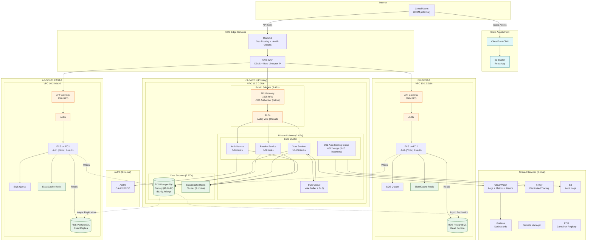

# 4.2 Deployment Diagram

AWS infrastructure distributed across **3 regions** (US-East, EU-West, AP-Southeast) to handle **250k RPS** peak. Writes centralized in US-East-1 (primary); reads served from local replicas.

---

## Regional Capacity

| Component | US-East-1 (Primary) | EU-West-1 | AP-Southeast-1 |
|-----------|---------------------|-----------|----------------|
| API Gateway | 100k RPS | 100k RPS | 100k RPS |
| EC2 Instances | 3-10 (m6i.2xlarge) | 3-10 | 3-10 |
| ECS Tasks (Vote) | 10-100 | 10-100 | 10-100 |
| RDS PostgreSQL | Primary (r6g.4xlarge) | Read Replica | Read Replica |
| Redis Cluster | 3 nodes | 3 nodes | 3 nodes |
| SQS | Unlimited throughput | Unlimited | Unlimited |

---

## Deployment Decisions

| Decision | Why |
|----------|-----|
| **Route53 Geolocation Routing** | Route users to closest region for lowest latency |
| **Multi-AZ per region** | RDS, ECS and ALB distributed across 3 AZs for HA |
| **Write to Primary only** | All votes write to US-East-1 RDS; avoids multi-master conflicts |
| **Read from local Replicas** | EU and AP read from local RDS replicas for low-latency results |
| **ECS on EC2 (not Fargate)** | Fargate is serverless (restricted). EC2 enables Reserved Instances and zero cold start |
| **Native JWT Authorizer** | Replaces Lambda Authorizer (serverless restricted). API Gateway validates JWT natively |

---

## Layer Details

### Edge Layer
- **Route53**: Geolocation routing + health checks, automatic failover (30s detection)
- **WAF**: DDoS protection, per-IP rate limiting, anti-bot rules
- **CloudFront**: CDN for React app static assets (served from S3, separate from API flow)

### Compute Layer (per region)
- **API Gateway**: Throttling, native JWT Authorizer (Auth0 issuer + audience)
- **ALB**: Health checks, target groups per service
- **ECS on EC2**: EC2 Auto Scaling Groups + ECS Service Auto Scaling (target CPU 70%)

### Data Layer
- **RDS PostgreSQL**: Multi-AZ, automated backups, point-in-time recovery
- **ElastiCache Redis**: Cluster mode for vote aggregates, deduplication, and session cache
- **SQS**: Standard queue with DLQ for vote buffering and retry

### Observability
- **CloudWatch**: Centralized logs, metrics, and alarms (infra + application)
- **X-Ray**: Distributed tracing across services
- **Grafana**: Dashboards via CloudWatch datasource

### Shared Services
- **Secrets Manager**: Automatic credential rotation for DB and API keys
- **ECR**: Container image registry for ECS deployments
- **S3**: Audit logs with lifecycle policy (90 days → Glacier)
