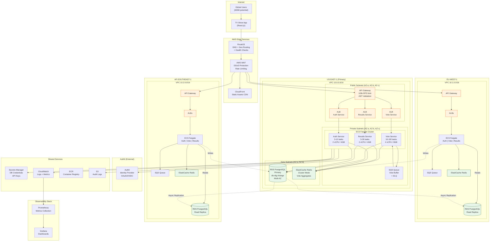

# 4.2 Deployment Diagram

The diagram below shows the AWS infrastructure distributed across **3 regions** (US-East, EU-West, AP-Southeast) to reach the **250k RPS** peak. Regions serve traffic locally with Route53 failover; writes are centralized in the primary region.

---

## Regional Capacity Legend

| Component | US-East-1 (Primary) | EU-West-1 | AP-Southeast-1 |
|------------|---------------------|-----------|----------------|
| API Gateway | 100k RPS | 100k RPS | 100k RPS |
| ECS Tasks (Vote) | 10-100 | 10-100 | 10-100 |
| RDS PostgreSQL | Primary (r6g.4xlarge) | Read Replica | Read Replica |
| Redis Cluster | 3 nodes | 3 nodes | 3 nodes |
| SQS Throughput | Unlimited | Unlimited | Unlimited |

---

## Deployment Decisions

| Decision | Description |
|---------|-----------|
| **Route53 Geolocation Routing** | Users are routed to the closest region |
| **Multi-AZ per region** | RDS and ECS are distributed across 3 AZs for HA |
| **Write to Primary** | All votes are written to RDS US-East-1 (primary) |
| **Read Replicas** | EU and AP read from local replicas for lower latency |

---

## Layer Details

### Edge Layer
- **Route53**: Geo-routing + health checks with automatic failover (30s detection)
- **WAF**: DDoS protection, per-IP rate limiting, anti-bot rules
- **CloudFront**: CDN for React app static assets

### Compute Layer (per region)
- **API Gateway**: Throttling, JWT validation via Lambda Authorizer
- **ALB**: Health checks, target groups per service
- **ECS Fargate**: Auto-scaling based on CPU/Memory (target 70%)

### Data Layer
- **RDS PostgreSQL**: Multi-AZ, automated backups, point-in-time recovery
- **ElastiCache Redis**: Cluster mode for vote aggregates and session cache
- **SQS**: Standard queue with DLQ for retry handling

### Shared Services
- **Secrets Manager**: Automatic credential rotation
- **CloudWatch**: Centralized logs, custom metrics
- **S3**: Audit logs with lifecycle policy (90 days → Glacier)
