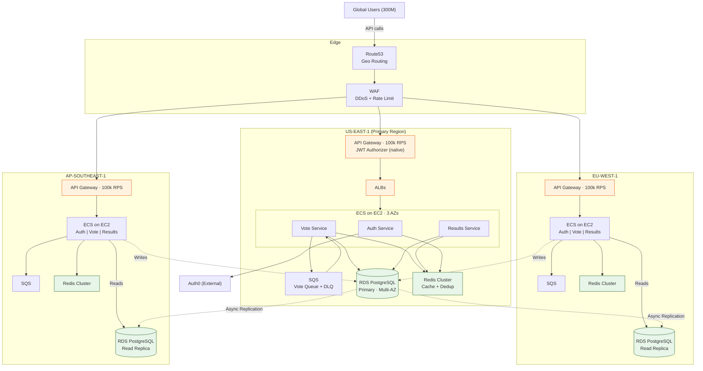

# 4.2 Deployment Diagram

AWS multi-region infrastructure (3 regions) to handle **250k RPS** peak. Writes centralized in US-East-1; reads from local replicas.

---

## Regional Capacity

| Component | US-East-1 (Primary) | EU-West-1 | AP-Southeast-1 |
|-----------|---------------------|-----------|----------------|
| API Gateway | 100k RPS | 100k RPS | 100k RPS |
| EC2 Instances | 3-10 (m6i.2xlarge) | 3-10 | 3-10 |
| ECS Tasks (Vote) | 10-100 | 10-100 | 10-100 |
| RDS PostgreSQL | Primary (r6g.4xlarge) | Read Replica | Read Replica |
| Redis Cluster | 3 nodes | 3 nodes | 3 nodes |
| SQS | Unlimited | Unlimited | Unlimited |

---

## Deployment Decisions

| Decision | Why |
|----------|-----|
| **3 Regions** | API Gateway caps at 100k RPS/region. 3 x 100k = 300k capacity for 250k peak |
| **Route53 Geo Routing** | Users routed to closest region (lowest latency) |
| **Multi-AZ (3 AZs)** | ECS and RDS distributed across AZs for high availability |
| **Write to Primary only** | All votes write to US-East-1 RDS; avoids multi-master conflicts |
| **Read from local Replica** | EU and AP read from local RDS replicas for low-latency results |
| **ECS on EC2** | Fargate is serverless (restricted). EC2 allows Reserved Instances and zero cold start |
| **Native JWT Authorizer** | Lambda Authorizer is serverless (restricted). API Gateway validates JWT natively |

---

## Layer Details

### Edge
- **Route53**: Geolocation routing + health checks, failover in 30s
- **WAF**: DDoS protection, per-IP rate limiting, anti-bot rules
- **CloudFront**: CDN for React static assets (separate flow, not shown)

### Compute (per region)
- **API Gateway**: Throttling + native JWT Authorizer (Auth0 issuer/audience)
- **ALB**: Health checks, target group per service
- **ECS on EC2**: EC2 ASG (instance scaling) + ECS Service Auto Scaling (task scaling), target CPU 70%

### Data (per region)
- **RDS PostgreSQL**: Multi-AZ, automated backups, PITR
- **ElastiCache Redis**: Cluster mode — vote aggregates, deduplication, session cache
- **SQS**: Standard queue + DLQ for vote buffering and retry

### Observability (not shown, see section 9)
- **CloudWatch**: Logs, metrics, alarms
- **X-Ray**: Distributed tracing
- **Grafana**: Dashboards (CloudWatch datasource)

### Shared Services (not shown)
- **Secrets Manager**: Automatic credential rotation
- **ECR**: Container image registry
- **S3**: Audit logs (90 days → Glacier)
