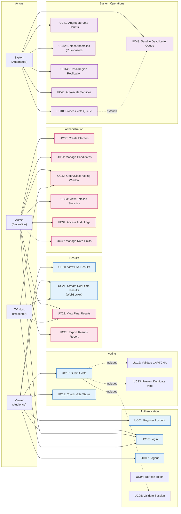
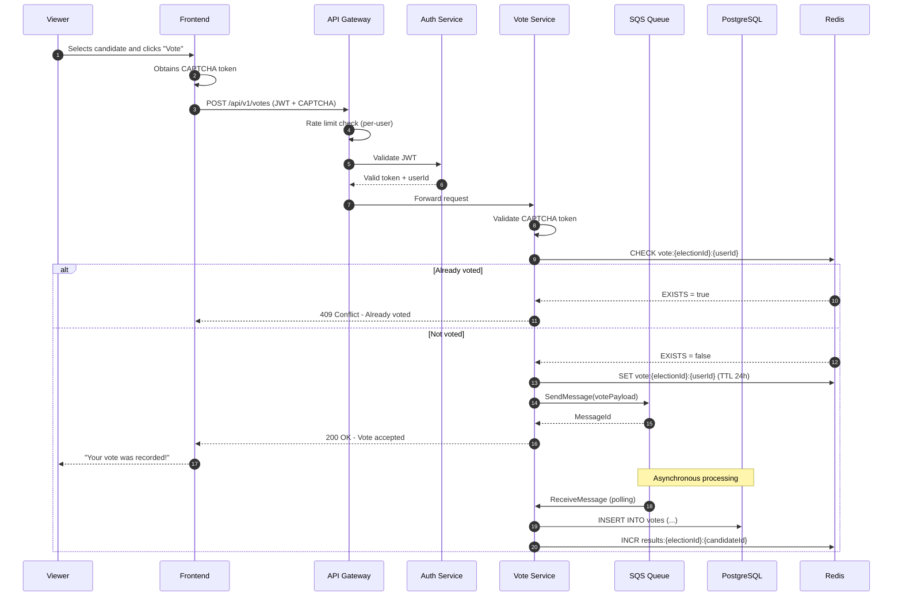

# 4.3 Use Cases Diagram

The diagram below represents the main capabilities of the voting system, organized by actor.

---

## Use Cases Table

### Authentication

| ID | Use Case | Primary Actor | Description | Priority |
|----|----------|----------------|-----------|------------|
| UC01 | Register Account | Viewer | Create account with email/social login via Auth0 | High |
| UC02 | Login | Viewer, Admin, TV Host | Authenticate and receive JWT token | High |
| UC03 | Logout | Viewer | Invalidate session and token | Medium |
| UC04 | Refresh Token | Viewer | Renew expired access token | High |
| UC05 | Validate Session | System | Validate JWT on each request | High |

### Voting

| ID | Use Case | Primary Actor | Description | Priority |
|----|----------|----------------|-----------|------------|
| UC10 | Submit Vote | Viewer | Submit vote for the selected candidate | High |
| UC11 | Check Vote Status | Viewer | Check if the user already voted in the current election | High |
| UC12 | Validate CAPTCHA | System | Validate anti-bot CAPTCHA token | High |
| UC13 | Prevent Duplicate Vote | System | Enforce exactly-once voting | High |

### Results

| ID | Use Case | Primary Actor | Description | Priority |
|----|----------|----------------|-----------|------------|
| UC20 | View Live Results | Viewer | View aggregated results in near real time | High |
| UC21 | Stream Real-time Results | Viewer, TV Host | Receive updates via WebSocket (<1s) | High |
| UC22 | View Final Results | Admin, TV Host | View final results after closing | Medium |
| UC23 | Export Results Report | Admin | Generate PDF/CSV report for audit | Low |

### Administration

| ID | Use Case | Primary Actor | Description | Priority |
|----|----------|----------------|-----------|------------|
| UC30 | Create Election | Admin | Create a new election with candidates | High |
| UC31 | Manage Candidates | Admin | Candidate CRUD | High |
| UC32 | Open/Close Voting Window | Admin, TV Host | Control the voting period | High |
| UC33 | View Detailed Statistics | Admin | Analytics by region, time, etc. | Medium |
| UC34 | Access Audit Logs | Admin | View immutable logs | Medium |
| UC35 | Manage Rate Limits | Admin | Configure throttling by user/IP | Medium |

### System Operations

| ID | Use Case | Primary Actor | Description | Priority |
|----|----------|----------------|-----------|------------|
| UC40 | Process Vote Queue | System | Consume SQS and persist votes | High |
| UC41 | Aggregate Vote Counts | System | Update counters in Redis | High |
| UC42 | Detect Anomalies | System | Identify suspicious patterns (rule-based) | Medium |
| UC43 | Send to Dead Letter Queue | System | Move failed messages to DLQ | High |
| UC44 | Cross-Region Replication | System | Synchronize data across regions | High |
| UC45 | Auto-scale Services | System | Scale ECS tasks based on metrics | High |

---

## Main Flow - Submit Vote (UC10)

---

## Actor Details

| Actor | Description | Authentication | Main Endpoints |
|------|-----------|--------------|---------------------|
| **Viewer** | Viewer voting during the live show | JWT via Auth0 | `/auth/*`, `/votes/*`, `/results/*` |
| **Admin** | Backoffice operator | JWT + Admin role | `/admin/*`, `/elections/*`, `/audit/*` |
| **TV Host** | Host who controls the live voting window | JWT + Host role | `/elections/control/*`, `/results/stream/*` |
| **System** | Automated processes | Internal (no auth) | SQS consumers, schedulers |

---

## Use Case Relationships

| Type | From | To | Description |
|------|-----|------|-----------|
| **includes** | UC10 (Submit Vote) | UC12 (Validate CAPTCHA) | Every vote requires CAPTCHA validation |
| **includes** | UC10 (Submit Vote) | UC13 (Prevent Duplicate) | Every vote checks for duplicates |
| **includes** | UC10 (Submit Vote) | UC05 (Validate Session) | Every vote requires a valid session |
| **extends** | UC40 (Process Queue) | UC43 (Send to DLQ) | Repeated failures go to the DLQ |
