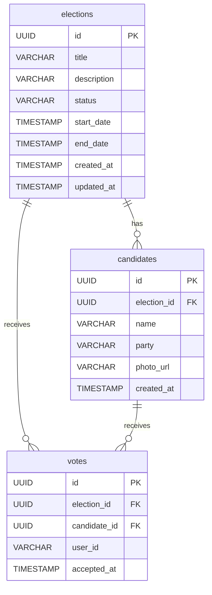

# 6.3 Persistence Model

## Database Tables (PostgreSQL)



### Constraints

| Table | Constraint | Type | Purpose |
|-------|-----------|------|---------|
| votes | `uq_votes_election_user (election_id, user_id)` | UNIQUE | Exactly-once voting at DB level |
| votes | `idx_votes_election_candidate (election_id, candidate_id)` | INDEX | Fast aggregation for results |
| candidates | `fk_candidates_election (election_id)` | FK | Cascade delete with election |

---

## Redis Cache Structure

| Key Pattern | Type | TTL | Purpose |
|-------------|------|-----|---------|
| `vote:{electionId}:{userId}` | STRING | 48h | Duplicate vote check |
| `results:{electionId}:{candidateId}` | STRING (counter) | None | Live vote count per candidate |
| `election:{electionId}` | HASH | 1h | Cached election metadata |

---

## Main Queries

### Redis — Check Duplicate Vote

```redis
EXISTS vote:{electionId}:{userId}
```
Returns `1` if user already voted.

### Redis — Increment Vote Counter

```redis
INCR results:{electionId}:{candidateId}
```
Atomically increments the candidate counter. Result Service reads these counters for live results.
